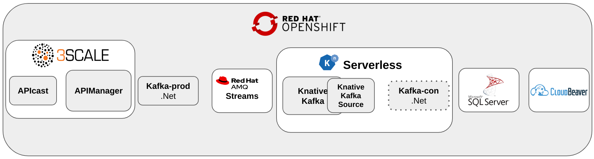
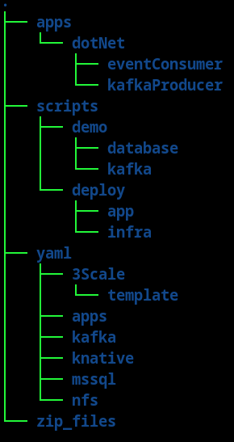

# Event Driven Architecture Demo with .NET and Quarkus

**Updated for: OpenShift Local 2.35.0 (OpenShift 4.15.10)

## Overview

This repository illustrates using Red Hat technology together with .NET application code in a simple eventing example.  The demo is designed to run on OpenShift.  The main components used by this demo are:

- 3Scale API Management
- AMQ Streams (Kafka)
- OpenShift Serverless (knative)
- Knative Kafka and Kafka Source (knative)
- Microsoft SQL Server (containerized)

Additionally a containerized web-based SQL client called CloudBeaver is used to introspect the state of the SQL Server instance.  

The application code is represented by two services, a producer service (Kafka-prod) used to place a message on AMQ Streams, and a consumer service (Kafka-con) to receive the message as a CloudEvent.  Kafka-con also runs in serverless which allows the service to spin down to zero instances when not needed.  This component architecture can be visualized as below.

## Organization

This repository is organized as follows:

The top level folders organize the categories of content.  For instance `apps` contains any application source code, `scripts` contains any scripted logic, `yaml` contains OpenShift/kubernetes resource definitions.  The final folder at this level is `zip_files`.  Due to github restrictions on large files some dependent content will need to be added after you clone the repository.  The `zip_files` folder contains a script to distribute this content to the appropriate locations.

Taking a closer look at the `scripts` folder, the second level folders are `demo` and `deploy`.  The `demo` folder contains resources for running the demo, while the `deploy` folder contains resources for setting up the environment.

## Getting Started

- [Prerequisites](docs/prereq.md)
- [Setting Up](docs/settingUp.md)
- [Deploy Demo Infra](docs/deployInfra.md)
- [Deploy App Services](docs/deployApps.md)
- [Setup CloudBeaver](docs/cloudBeaver.md)
- [Login to 3Scale](docs/3scale.md)
- [Stepping through the Demo](docs/demo.md)

## .NET Core

- [Creating a WebApp](docs/webApp.md)
- [Creating a WebAPI](docs/webAPI.md)
- [Producer Service](docs/kafkaProducer.md)
- [Consumer Service](docs/eventConsumer.md)
