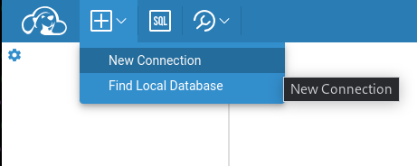

# CloudBeaver

CloudBeaver is a containerized we SQL client we are using to interact with the Microsoft SQL Server instance.  Before accessing CloudBeaver we will need to obtain some connection information for our SQL Server database.  We need to find the service hostname for the database.  In the OpenShift console select the project `mssql` and go to `Networking->Services`.  Select sqlserver from there.  You should see a screen similar to:


On the right side of the screen notice under the Section **Service routing**, is specified the `Hostname`.  In my example above the value is `sqlserver.mssql.svc.cluster.local`.  You should record the `Hostname` value you see reported there.

You can get the URL for CloudBeaver by looking up the route created in the `mssql-client` project (`Networking->Routes`).  


The URL should be like:

```bash
http://cloudbeaver-mssql-client.apps.<openshift-domain>/
```

*Note: OpenShift Local tends to use ".apps-" instead of ".apps.".*

The first time you access the service, you will see the configuration wizard.  This is where you set up login details and you can also configure database connections.  


After hitting next you will be given the opportunity to set you login details for CloudBeaver:


Afterwards you will be asked to login using the credentials you just created:


After logging in, click on the 'plus sign in a square box' on the top left of your screen and select New Connection.



Select SQL Server from the pop-up dialog box.

Here change the **Host** value from `localhost` to the service host value we recorded earlier for SQL Server.  Under **AUTHENTICATION**, set '`sa`' for the **User name** and '`redHat2023!`' for the **User password**.  To finish click on **Create**.

You should see a new connection in the left side pane:


Select this new connection to highlight it and then click on the 'SQL box' on the top right of the screen.  This will open the SQL editor.  Your file title have something like "sql-1 (SQL Server@sqlserver...".  The important part here is that this file is associated with your new connection.  This is indicated by the bracketed part.

We are going to add 3 scripts to CloudBeaver.  In the cloned git repository move to scripts/demo/database.  This folder contains scripts to create, destroy and query our database.  Let's first copy the contents of create.sql into the CloudBeaver SQL editor.


Click on the document icon (circled in red above) to 'Save as script'.  A dialog box will appear allowing you to adjust the name of the script.  You can name it something meaningful like createDB.  The createDB script will now be listed on the right side pane.

Execute the script by clicking on the document icon with a play symbol (circled in green above).

You can repeate this process to add the drop.sql and query.sql scripts.  Do not execute the drop script.  You can test the query script.  You should see an empty table.  The database is now ready for the demo.

---

[[back](../README.md#getting-started)]
