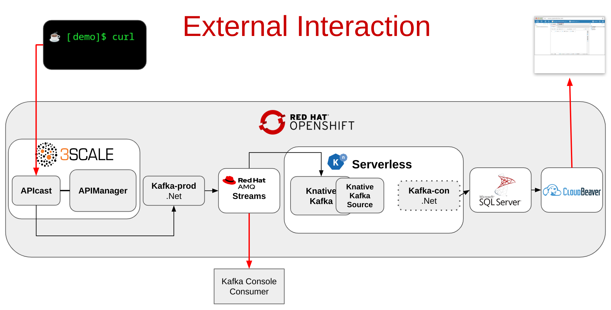

# Demo

## Preflight notes

Before starting the demo make sure that you have configured the Producer service URL in 3Scale.  Depending on the focus this can also be done as part of the demo walk through.

## Demo Flow

### Start Monitoring Services

Each in a separate window start the following:

- monitorProducerSvcLogs.sh

- monitorConsumerSvcLogs.sh

- consoleConsumer.sh (kafka console listener in kafka subfolder)

- Log into CloudBeaver and run the table query

### Demo:

- Show pod spun down on topology tab

- curl directly to Producer service

- Show pod now spun up on topology tab

- Show producer service logs

- Show kafka tap (kafka console listener)

- Show consumer service logs

- Show CloudBeaver table query

- Log into 3scale Admin Portal (use get3ScaleLoginInfo.sh for credentials)

- Show configuration of backend URL (this is what we used with curl so far)
  
  `Products -> Kafka API -> Integration -> Backends`

- Show configuration of Secret token
  
  `Integration -> Settings`

- Show the pods spun down on the topology tab

- curl to the 3Scale API

- Show pod now spun up on topology tab

- Show producer service logs

- Show kafka tap (kafka console listener)

- Show consumer service logs

- Show CloudBeaver table query

---

[[back](../README.md#getting-started)]
