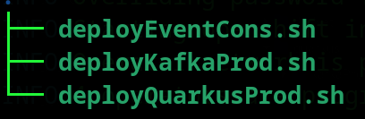

# Deploying Demo Apps

This demo uses two application service written in .NET (C#).  The deployment scripts are located in the `scripts/deploy/app` folder.



`deployKafkaProd.sh` deploys the Kafka message producer service.  This service receives an `HTTP` `POST` request and puts the `JSON` payload onto AMQ Streams as a message.

This script makes use of OpenShift's `Source-to-Image` (`S2I`) capability. `S2I` is a standard process within OpenShift that automates the source compilation and container build for applications. Although we have not done so here, you can augment this process by making `S2I` part of a build pipeline.

`deployQuarkusProd.sh` is a Quarkus implementation of the message producer service described above. This implementation uses the smallrye client library.  The Quarkus service is optional to deploy.  The demo only needs one producer.  If you decide to deploy this script, update the value for `JAVA_HOME`.

```bash
  export JAVA_HOME=/usr/lib/jvm/jre-17-openjdk-17.0.10.0.7-3.fc40.x86_64
```

Also you may wish to update the build VERSION in the Quarkus script if you desire to reset the version count or to increment it.

```bash
# Code version
VERSION=1.8
```

Both versions of the producer service leverage using secrets and configmaps.  Unlike the .NET version, the Quarkus based service uses podman to create the container.

`deployEventCons.sh` deploys a serverless service that consumes events generated from Kafka messages.  It then persists the `JSON` payload to a containerized SQL Server instance.

This script demonstrates using .NET build techniques and builds the container using podman.  The script then tags and pushes the container to the quay.io user repository.  It then deploys the container to OpenShift using a `YAML` resource definition.  

In this script you will want to look at the following variables.

```bash
# Code version
VERSION=1.5

# Rebuild code or just deploy container with this version tag
REBUILD=true
```

`VERSION` is where you specify the version label the container should be tagged with.  You will want to increment this value for consecutive builds.

`REBUILD` is a boolean setting that toggles whether we need to build a new container or just deploy and existing container from Quay.io.

---

[[back](../README.md#getting-started)]
