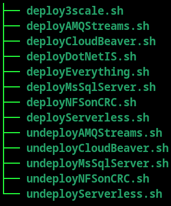

# Deploying Demo Infra

Deploying the demo infrastructure on top of OpenShift involves setting up the following:

- 3Scale

- AMQ Streams

- Serverless

- Microsoft SQL Server

- CloudBeaver (SQL web client)

To support this we do also have the following dependencies:

- NFS provisioner

- .NET OpenShift Image Streams

The NFS provisioner is used to provide a RWX filesystem required by one of the pods in the 3Scale deployment.  This was chosen as a lightweight solution that is workable on a constrained system such as OpenShift Local.  For production there are better options.

The .NET OpenShift Image Streams are required to support the C# application services we will deploy later.

 ****

Scripts are provided for deploying/undeploying these components in `scripts/deploy/infra`.  

There are individual scripts for each component and one script named `deployEverything.sh` to sequentially run the other scripts.  You do not have to use this orchestrator script.  It is merely provided as a convenience.  Similarly there are undeploy scripts.  You may notice that there is not an undeploy script for `DotNetIS`.  These image streams do not need to be removed.  In most cases you already had them.  The deploy script updates these image streams to ensure that you have the latest images.  The `deployEverything.sh` also creates an installation log to track progress and also inspect if the installation is not successful.

****

[[back](../README.md#getting-started)]
